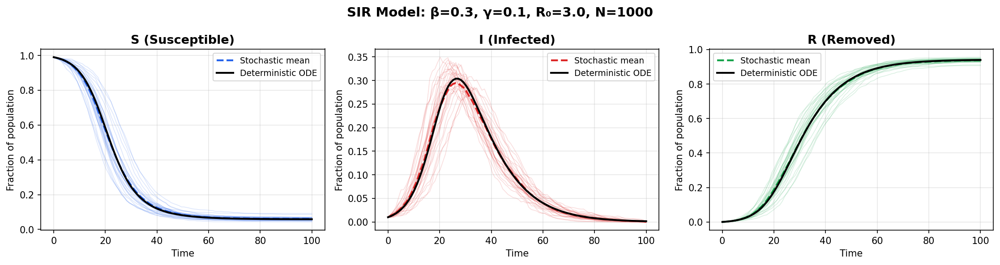
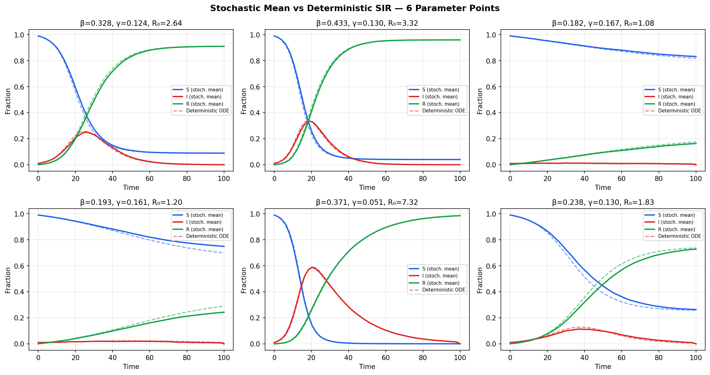
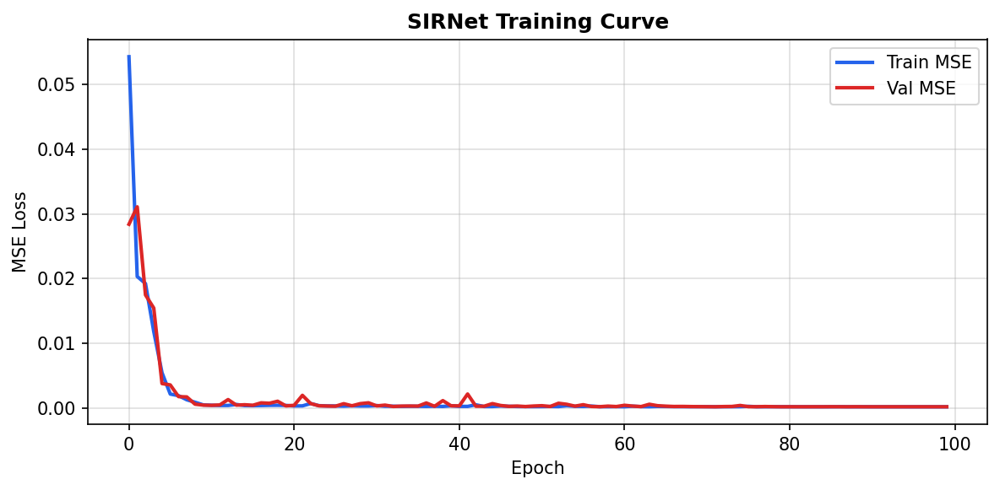
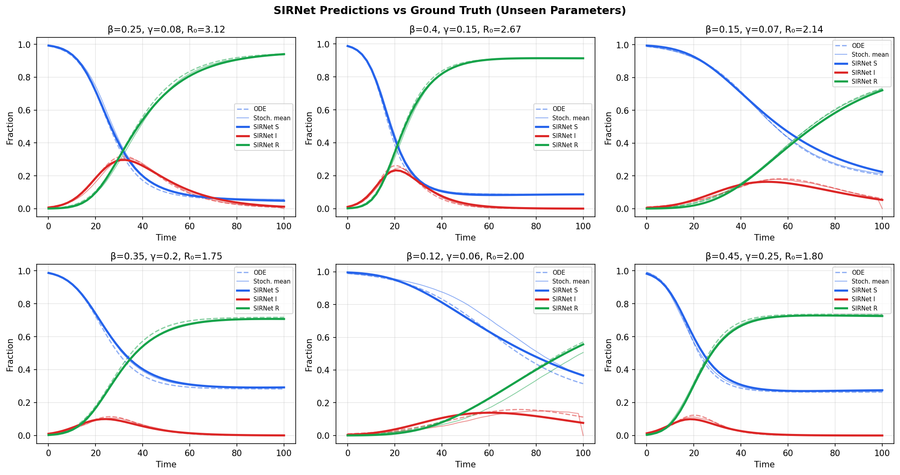
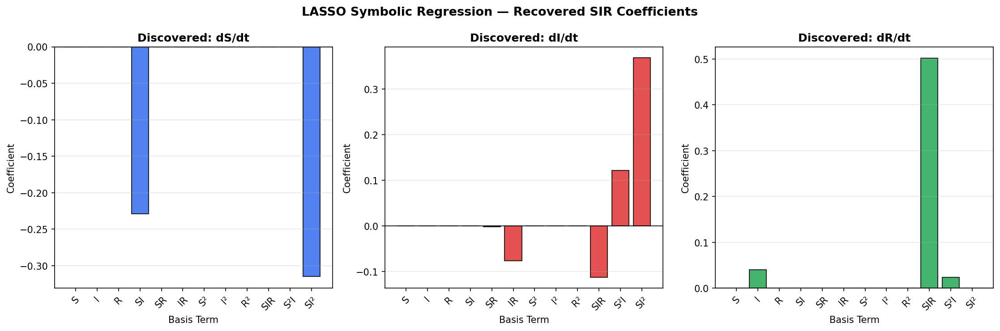
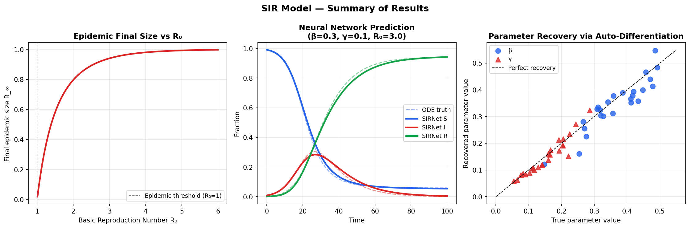

# Learning the SIR Model — GSoC 2026 HumanAI

Machine learning pipeline to deduce the deterministic SIR epidemic model from stochastic simulations, without assuming the ODE structure.

---

## What this does

1. Simulates synthetic epidemics using the Gillespie stochastic algorithm across 600 (β, γ) parameter points
2. Trains a neural network to map (β, γ, t) → mean (S, I, R) trajectories
3. Uses PyTorch autograd to extract exact time derivatives from the trained network
4. Applies LASSO sparse regression over a polynomial basis to rediscover the ODE structure from data

---

## Results

| | S | I | R | Overall |
|---|---|---|---|---|
| MSE | 0.000202 | 0.000099 | 0.000216 | 0.000172 |
| MAE | 0.010177 | 0.006863 | 0.010841 | — |
| R²  | 0.9983 | 0.9891 | 0.9982 | 0.9952 |

Parameter recovery via auto-differentiation (β error / γ error across 6 test cases):

| β_true | γ_true | β_err% | γ_err% |
|---|---|---|---|
| 0.300 | 0.100 | 3.5% | 13.2% |
| 0.250 | 0.080 | 1.1% | 7.7% |
| 0.400 | 0.150 | 6.3% | 14.8% |
| 0.200 | 0.070 | 4.3% | 0.6% |
| 0.350 | 0.120 | 7.9% | 14.7% |
| 0.450 | 0.200 | 0.8% | 7.5% |

---

## Plots

| | |
|---|---|
|  |  |
|  |  |
|  |  |

---

## Run

```bash
pip install torch numpy matplotlib scipy scikit-learn sympy tqdm
jupyter notebook SIR_GSoC.ipynb
```

Or open directly in [Google Colab](https://colab.research.google.com/).
